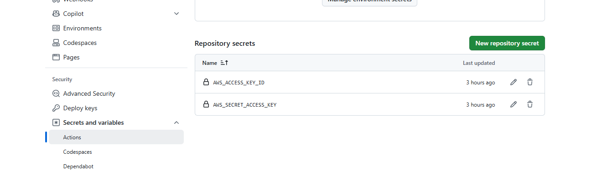
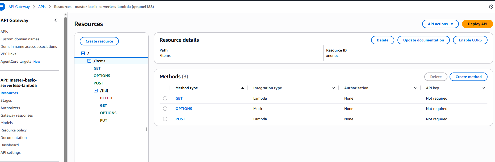
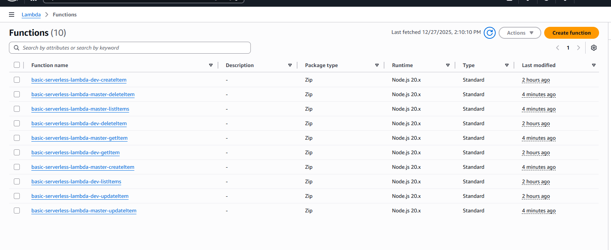
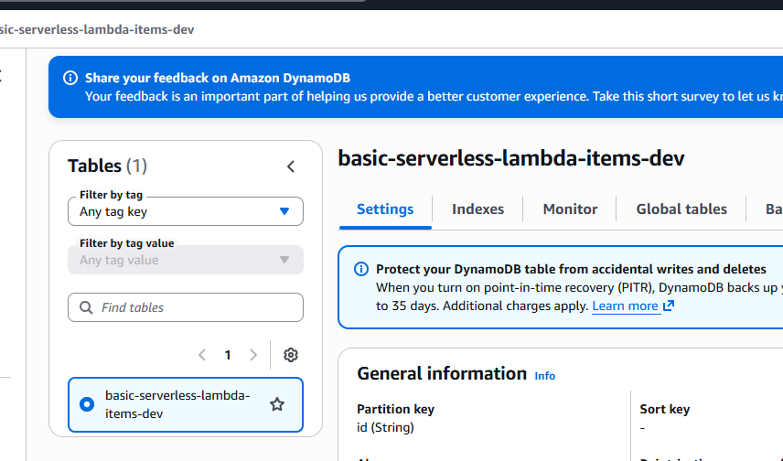
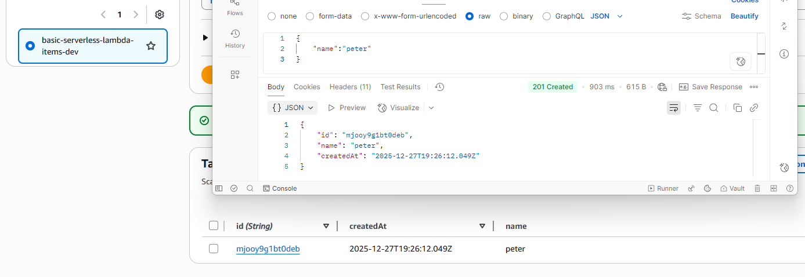

<!--
title: 'AWS Node Scheduled Cron example in NodeJS'
description: 'This is an example of creating a function that runs as a cron job using the serverless ''schedule'' event.'
layout: Doc
framework: v4
platform: AWS
language: nodeJS
priority: 1
authorLink: 'https://github.com/0dj0bz'
authorName: 'Rob Abbott'
authorAvatar: 'https://avatars3.githubusercontent.com/u/5679763?v=4&s=140'
-->
GUIDE : 
ADD Secret in github 


Gateway


Lambda


Dynamo DB 


OUTPUT 


Workflows / go here https://github.com/serverless/github-action
```
name: Deploy master branch

on:
  push:
    branches:
      - master

jobs:
  deploy:
    name: deploy
    runs-on: ubuntu-latest
    strategy:
      matrix:
        node-version: [22.x]
    steps:
    - uses: actions/checkout@v3
    - name: Use Node.js ${{ matrix.node-version }}
      uses: actions/setup-node@v3
      with:
        node-version: ${{ matrix.node-version }}
    - name: serverless deploy
      uses: serverless/github-action@v3.2
      with:
        args: deploy
      env:
        //this is commented SERVERLESS_ACCESS_KEY: ${{ secrets.SERVERLESS_ACCESS_KEY }}
        // or if using AWS credentials directly
        AWS_ACCESS_KEY_ID: ${{ secrets.AWS_ACCESS_KEY_ID }}
        AWS_SECRET_ACCESS_KEY: ${{ secrets.AWS_SECRET_ACCESS_KEY }}
```
# Serverless Framework Node Scheduled Cron on AWS

This template demonstrates how to develop and deploy a simple cron-like service running on AWS Lambda using the Serverless Framework.

This examples defines a single function, `rateHandler` which is triggered by an event of `schedule` type at a rate of 1 per minute. For detailed information about `schedule` event, please refer to corresponding section of Serverless [docs](https://serverless.com/framework/docs/providers/aws/events/schedule/).

## Usage

### Deployment

In order to deploy the example, you need to run the following command:

```
serverless deploy
```

After running deploy, you should see output similar to:

```
Deploying "aws-node-scheduled-cron" to stage "dev" (us-east-1)

✔ Service deployed to stack aws-node-scheduled-cron-dev (151s)

functions:
  rateHandler: aws-node-scheduled-cron-dev-rateHandler (2.3 kB)

```

There is no additional step required. Your defined schedules becomes active right away after deployment.

### Local development

The easiest way to develop and test your function is to use the `dev` command:

```
serverless dev
```

This will start a local emulator of AWS Lambda and tunnel your requests to and from AWS Lambda, allowing you to interact with your function as if it were running in the cloud.

Now you can invoke the function as before, but this time the function will be executed locally. Now you can develop your function locally, invoke it, and see the results immediately without having to re-deploy.

When you are done developing, don't forget to run `serverless deploy` to deploy the function to the cloud.

